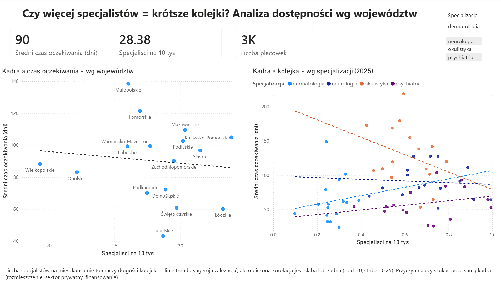
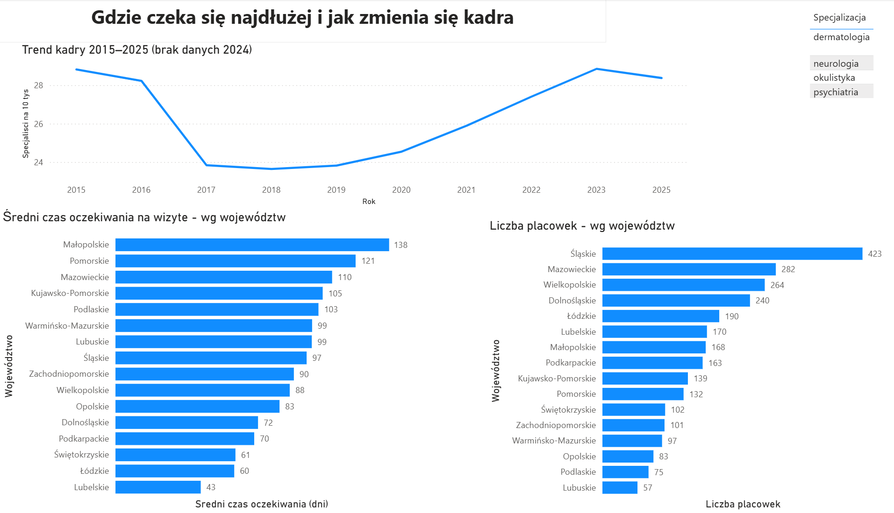

# Specialist Availability vs. NHF Waiting Times — A Power BI Analysis

An analysis testing whether the number of medical specialists per capita explains how long patients wait in public-healthcare queues across Polish regions. Conclusion: contrary to intuition, the number of doctors does **not** explain waiting times — the relationship turned out to be statistically insignificant, suggesting the causes lie elsewhere.

> **Context for non-Polish readers:** *NFZ (Narodowy Fundusz Zdrowia)* is Poland's National Health Fund — the public payer for healthcare. *MZ-89* is a mandatory reporting form submitted by healthcare providers to the Ministry of Health. *Województwo* = voivodeship, a Polish administrative region (there are 16).

---

## Question

Does the number of specialists per capita explain how long a patient waits in a public-healthcare (NFZ) queue?

The idea came from everyday experience — I wait months for specialist appointments myself, and many people wait years. Despite paying contributions, patients often give up on the public queue and pay for private visits instead. I wanted to find out where the problem really lies: whether the queues simply come from a shortage of doctors in a given specialty, or from something else.

For the analysis I chose four specialties with the longest queues and reliable available data (psychiatry, neurology, ophthalmology, dermatology), broken down by 16 voivodeships.

---

## Key Finding

The simple hypothesis "fewer doctors = longer queues" **is not supported by the data.**

To test this properly, I calculated the (Pearson) correlation coefficient between the number of specialists per capita and the average waiting time — separately for each of the four specialties:

| Specialty | Correlation (r) | Interpretation |
|---|---|---|
| Ophthalmology | −0.31 | weak negative |
| Dermatology | +0.13 | none |
| Neurology | −0.07 | none |
| Psychiatry | +0.25 | weak positive |

All coefficients fall between −0.31 and +0.25, meaning there is **no significant relationship** — for none of the specialties does the number of doctors explain queue length. Although Power BI drew trend lines on the scatter plots suggesting some relationship, calculating the correlation coefficient showed it to be illusory — the line passes through scattered points but does not describe them.

**Conclusion: queue length is driven by something other than the sheer number of specialists.** The most likely factors are ones this project does not cover: distribution of facilities, the role of the private sector, how the NFZ funds services, the organization of admissions, or patient migration between regions.

The facility-count analysis supports this: the Silesian voivodeship has the most facilities (423), yet is among the regions with the longest queues. More facilities does not mean shorter waiting.

> **Method:** Pearson correlation, n=16 voivodeships per specialty, 2025 data. Conclusions are based on numbers, not on visual interpretation of charts. Details and caveats in the [Limitations](#limitations) section.

---

## Data & Sources

The project combines data from three independent public sources:

- **NFZ queues** — waiting times and number of people waiting for services, pulled from the public NFZ API (Treatment Term Information System, `/queues` endpoint). Data fetched parametrically for 4 specialties × 16 voivodeships. Snapshot as of 2026.
- **Number of specialists** — MZ-89 reports, dataset "Specialist physicians employed in healthcare facilities by voivodeship," [dane.gov.pl](https://dane.gov.pl/pl/dataset/2107). Range: 2015–2025 (no 2024 data).
- **Regional population** — [Statistics Poland (GUS), Local Data Bank](https://bdl.stat.gov.pl), used to express the number of specialists per 10,000 inhabitants. Range: 2015–2025.

Analysis scope: **4 specialties** (psychiatry, neurology, ophthalmology, dermatology) × **16 voivodeships**.

> **Notes on the data:**
> - **Time range:** queue data is a 2026 snapshot, while workforce data covers 2015–2025. A deliberate trade-off — NFZ queues were available as a current state, not a time series. The main analysis (workforce–queues correlation) uses the 2025 workforce data.
> - **2024 gap:** the specialist dataset contains no data for 2024, so the workforce trend chart skips that year (the line connects 2023 to 2025).

---

## How It Was Built

**Data acquisition & cleaning — Power Query**

I pulled the queue data from the NFZ API (Treatment Term Information System) parametrically. I wrote a function `fn_pobierz_wszystko(benefit, voivodeship)` and called it for each of the 64 combinations (4 specialties × 16 voivodeships). The API returns results in pages of at most 25 records, so the function calculates the number of pages needed on its own (based on the `meta.count` field in the API response) and fetches all of them — roughly 300–400 requests per data refresh.

An added difficulty: service names in the NFZ API are inconsistent across specialties (e.g. "PORADNIA ZDROWIA PSYCHICZNEGO" for psychiatry, but "ŚWIADCZENIA Z ZAKRESU NEUROLOGII" for neurology). I had to verify each name manually in the browser before building the automation.

Cleaning included: expanding nested structures, standardizing types (voivodeship and TERYT codes as text, to preserve leading zeros; numeric values and coordinates in en-US format), and **keeping empty values as empty rather than zeros** — converting them to zero would have deflated the average waiting times.

**Data model — star schema**

I organized the data into a star schema: at the center, tables with the values to analyze (NFZ queues, number of specialists, population), and around them descriptive tables I filter those values by — voivodeships, specialties, and years. This way a single filter (e.g. selecting a specialty) acts on the whole dashboard.

The voivodeships were labeled three different ways across the three sources (name, NFZ code "01–16", TERYT code). To link them, I built a bridging table connecting all three labels — without it the tables couldn't be related to one another.

**Measures — DAX**

- `Average waiting time (days)` — average waiting time from the NFZ data
- `Specialists per 10k` — number of specialists divided by the voivodeship population and multiplied by 10,000 (a "per capita" conversion, to compare voivodeships of different sizes)
- `Number of facilities` — count of unique providers

**Visualization — Power BI + Excel**

A two-page dashboard: an "Overview" page (KPIs + the workforce–queues relationship) and a "Details" page (regional rankings + the specialist trend over time). I calculated the correlation coefficients additionally in Excel (Pearson correlation), since it let me verify the relationships numerically rather than just visually.

---

## Dashboard

An interactive Power BI dashboard, two pages linked by a shared specialty filter.

**Page 1 — Overview**

KPIs (average waiting time, specialists per 10k, number of facilities) and two scatter plots showing the relationship (or rather the lack of it) between the number of specialists and waiting time — for the selected specialty and for all four at once.

**Page 2 — Details**

The specialist trend across 2015–2025, plus voivodeship rankings: by waiting time and by number of facilities.

---

## Limitations

The conclusions of this analysis should be treated as signals, not hard proof — for several reasons:

- **Small sample (n=16).** Each correlation is computed over 16 voivodeships. That is too few for strong statistical conclusions — the results show tendencies, not certainties.
- **Only four specialties.** A lack of relationship in four fields doesn't mean it doesn't exist in others. A fuller picture would require examining more specialties.
- **Correlation ≠ causation.** Even if the relationship were stronger, co-occurrence does not mean one causes the other.
- **Definition of "specialist."** The specialist counts come from MZ-89 reports, whose definition may not cover every practicing physician in a given specialty (e.g. the psychiatry figures appear understated).
- **2017 drop — cause unconfirmed.** The specialist data shows a clear drop between 2016 and 2017. The cause requires verification — it likely stems from methodological changes in reporting (possibly linked to the 2017 hospital-network reform or a change in the definition of an "employed specialist"), but this is not confirmed in the source's methodological notes. The drop should therefore not be read as a certain real loss of workforce.
- **Different time ranges.** Queues are a 2026 state, workforce is 2015–2025 — a pairing of the most recent available data, but not from the same point in time.
- **2024 gap.** No specialist data for 2024.
- **Unweighted average.** The average waiting time is a simple average across facilities, not weighted by their size or patient volume.
- **Stable cases only.** From the NFZ API I pulled only stable cases (`case=1`), omitting urgent cases (`case=2`) as a separate category.

---

## What's Next

Directions in which the project could be developed:

- **More specialties** — checking whether the lack of relationship holds more broadly, or applies only to these four fields.
- **Other factors** — incorporating data that might genuinely explain the queues: facility distribution, the role of the private sector, NFZ funding.
- **Urgent cases** — adding the `case=2` category (urgent cases) alongside the stable ones, to compare the two queue types.
- **Change over time** — pairing queues and workforce from the same period (if historical queue data were available), instead of a snapshot.

---

## How to Run

1. Download the file `dostepnosc_specjalistow.pbix`.
2. Open it in [Power BI Desktop](https://powerbi.microsoft.com/desktop/) (free).
3. The dashboard is interactive — use the specialty filter to switch between psychiatry, neurology, ophthalmology, and dermatology.

The data in the file is a 2026 snapshot.

---

*Portfolio project — data analysis (Junior Data Analyst). Tools: Power BI (Power Query, DAX), Excel.*

*A Polish-language version of this README is available in [README.md](README.md).*
